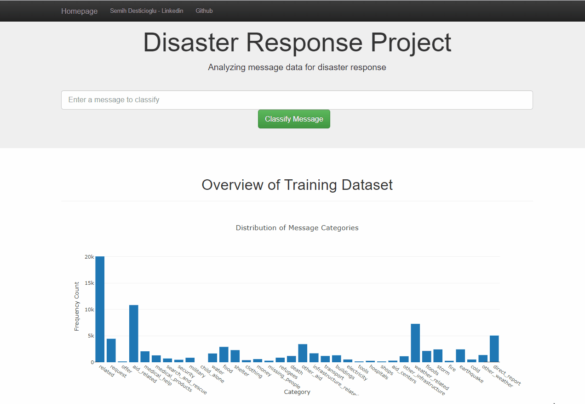
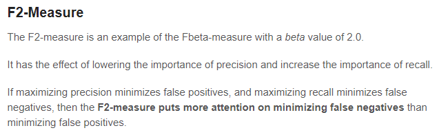
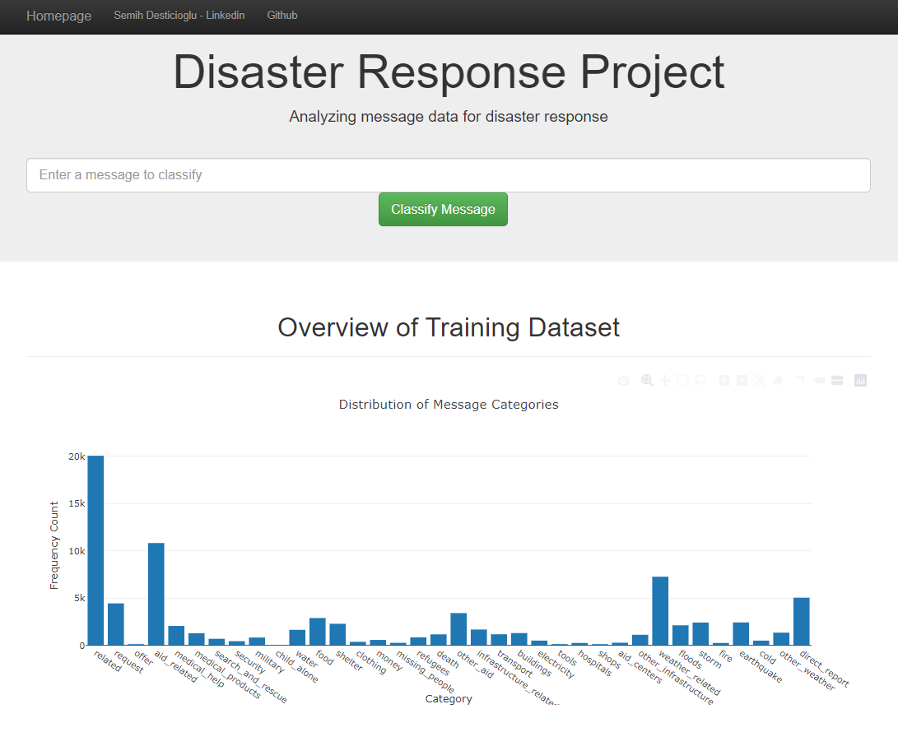
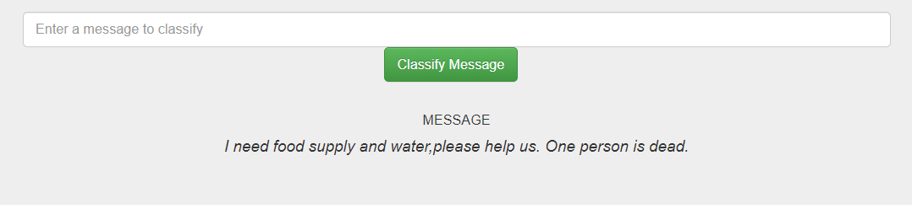
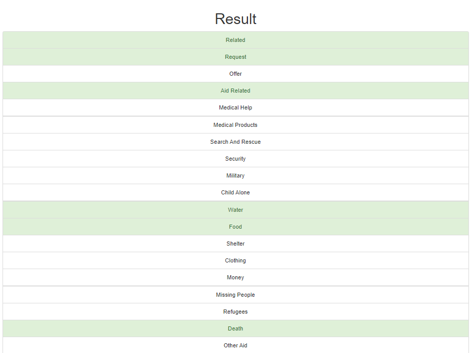

# Disaster Response Project - Multioutput NLP Classifier 
## Heal the world with Machine Learning :earth_americas: :volcano::sunrise_over_mountains:

### Table of Contents

1. [Project Overview](#ProjectOverview)
2. [Findings on ML processes](#FindingsonMLprocesses)
3. [File Descriptions](#FileDescriptions)
4. [Instructions](#Instructions)
5. [Screenshots](#Screenshots)                                   

## 1. Project Overview
In this project, we will build a Multioutput Classification model to predict message categories in future possible disasters.There are 36 pre-defined categories, and examples of these categories include Aid Related, Medical Help,Food, Death etc. By classifying these messages, we can help government or other aid organizations about prioritizing critical messases in possible disaster events.  This project inlcudes the building of a basic ETL and Machine Learning pipeline to achieve the task.

This project includes a web app version too, you can run it in your local with information below. Project is also implemented on heroku website. Anyone can reach to web site from internet and test the model by inputting their message. 
Heroku page : TBD

This project is created as a part of Udacity Data Scientist Nanodegree Program.

### Data:
The data in this project comes from Figure Eight - Multilingual Disaster Response Messages. This dataset contains 30,000 messages drawn from events including an earthquake in Haiti in 2010, an earthquake in Chile in 2010, floods in Pakistan in 2010, super-storm Sandy in the U.S.A. in 2012, and news articles spanning a large number of years and 100s of different disasters.

The data has been encoded with 36 different categories related to disaster response and has been stripped of messages with sensitive information in their entirety.

Data includes 2 csv files:

1. messages.csv: Messages data.
2. categories.csv: Disaster categories of messages.

## 2. Findings on ML processes 
Since this project aims multioutput classifying, for some categories there is a class imbalance state. To prevent this best tactic is using class weight option in sklearn and running decision tree based algorithms with new class weights. Poorly, sklearn's class weight ability gives error when there is no single sample for positive class while cross-validating. In our data, some categories have very lass amount of positive class samples, because of this reason we can not implement class weight strategy in this project. It gives an error since it can not find any positive class in testing on validation data.

In imbalanced data we should focus on F1 Score, not in accuracy. Because negative class contains more than 90% of data in some categories, accuracy can be easily over 90% if we predict all sample with negative class. This will give a good accuracy but poor F1 Score , especially for positive class.

In this project , we focus on catching critical messages. In this view, false negatives are more critical for us. We do not want miss critical food or water helps, or rescue helps. In order to get a better model from this perspective, recall will be more useful for us. I created a custom scoring function derived from fbeta with beta=2, actually this is corresponds to F2 measure.

More info in here :
https://machinelearningmastery.com/fbeta-measure-for-machine-learning/

## 3. File Descriptions
~~~~~~~
        disaster_response_pipeline
          |-- app                            
                |-- templates                //contains html file for the web application
                        |-- go.html
                        |-- master.html
                |-- run.py                   //Flask file to run the web application
          |-- data
                |-- messages.csv     // text data for messages
                |-- categories.csv   // category data for messages
                |-- messages.db      // output of the ETL pipeline
                |-- data_preparation.py  // ETL pipeline scripts
                |-- ETL Pipeline Preparation.ipynb  //ipynb notebook for preparation processes
          |-- models
                |-- classifier.pkl    //machine learning model's best estimator prameters in a pickle file
                |-- train_classifier.py  //machine learning pipeline scripts to train and create a classifier model pickle
                |-- ML Pipeline Preparation.ipynb  ////ipynb notebook for modelling processes

          |-- README
          |-- Screenshots
~~~~~~~

## 4. Instructions for deploying web app on local:

### Dependencies:
* Python 3.5+
* Machine Learning Libraries: NumPy, SciPy, Pandas, Sciki-Learn
* Natural Language Process Libraries: NLTK
* SQLlite Database Libraqries: SQLalchemy
* Model Loading and Saving Library: Pickle
* Web App and Data Visualization: Flask, Plotly

1. You can run the following commands in the project's directory to set up the database, train model and save the model.

    - To run ETL pipeline to clean data and store the processed data in the database
        `python data/data_preparation.py data/messages.csv data/categories.csv data/messages.db`
    - To run the ML pipeline that loads data from DB, trains classifier and saves the classifier as a pickle file
        `python models/train_classifier.py data/messages.db models/classifier.pkl`

2. Run the following command in the app's directory to run your web app.
    `python run.py`

3. Go to http://0.0.0.0:3001/

## 5. Screenshots

### Web App Overview

### Sample Input Message

### Sample Output

